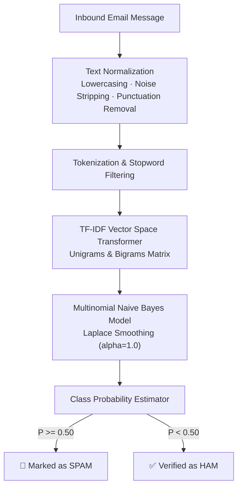

<div align="center">

# 📧 Email Spam Detection System

### NLP-Powered Text Classification Pipeline with TF-IDF Vectorization & Multinomial Naive Bayes

[](https://python.org)
[](https://scikit-learn.org)
[](LICENSE)

<p align="center">
  
  
  
  
</p>

*A high-accuracy natural language processing pipeline designed to classify inbound emails into Spam vs. Ham (legitimate) using probabilistic token frequency modeling and sublinear TF-IDF scaling.*

</div>

---

## 🌟 Core Highlights

- ⚡ **High-Speed Inference:** Real-time probabilistic text classification executing in less than 5ms per message.
- 📊 **Sublinear TF-IDF Feature Extraction:** Mitigates the influence of recurring non-informative tokens while boosting distinctive spam keywords.
- 🧠 **Laplace-Smoothed Naive Bayes:** Prevents zero-probability cold-start errors for out-of-vocabulary words.
- 🔄 **Production Serialization:** Pre-fitted vectorizer and classifier serialized via `joblib` for rapid deployment.

---

## 🏗️ Classification Pipeline Architecture



---

## 🔬 Mathematical Foundation

Classification decisions follow the Maximum A Posteriori (MAP) probabilistic decision boundary:

$$\hat{y} = \arg\max_{c \in \{\text{Spam}, \text{Ham}\}} \left[ \log P(c) + \sum_{i=1}^{V} x_i \cdot \log P(w_i \mid c) \right]$$

Where:
- $P(c)$ represents the class prior probability.
- $P(w_i \mid c)$ is estimated with Laplace smoothing: $\frac{N_{ci} + \alpha}{N_c + \alpha \cdot |V|}$.
- $x_i$ represents the TF-IDF feature weight for token $w_i$.

---

## 🚀 Quick Start Guide

### Prerequisites
- Python 3.8+
- pip

### 1. Clone & Set Up
```bash
git clone https://github.com/Izumi6/Email-Spam-Detection-System-.git
cd Email-Spam-Detection-System-
pip install pandas scikit-learn joblib
```

### 2. Train & Evaluate the Classifier
```bash
python spam_detection.py
```
*Outputs accuracy scores, confusion matrix, precision/recall curves, and exports the serialized model.*

---

## 🛠️ Technology Stack

| Layer | Technology |
|:---|:---|
| **Core Language** | Python 3.8+ |
| **NLP & Modeling** | Scikit-learn (TfidfVectorizer, MultinomialNB) |
| **Data Processing** | Pandas, NumPy |
| **Model Serialization** | Joblib |

---

## 👤 Author

**Suyash Vakhariya**  
*AI Engineer & Machine Learning Researcher*  
- **Portfolio:** [suyashvakhariya.com](https://suyashvakhariya.com)  
- **LinkedIn:** [linkedin.com/in/suyashvakhariya](https://www.linkedin.com/in/suyashvakhariya)  
- **GitHub:** [@Izumi6](https://github.com/Izumi6)  

---

## 📄 License

This project is licensed under the [MIT License](LICENSE).
